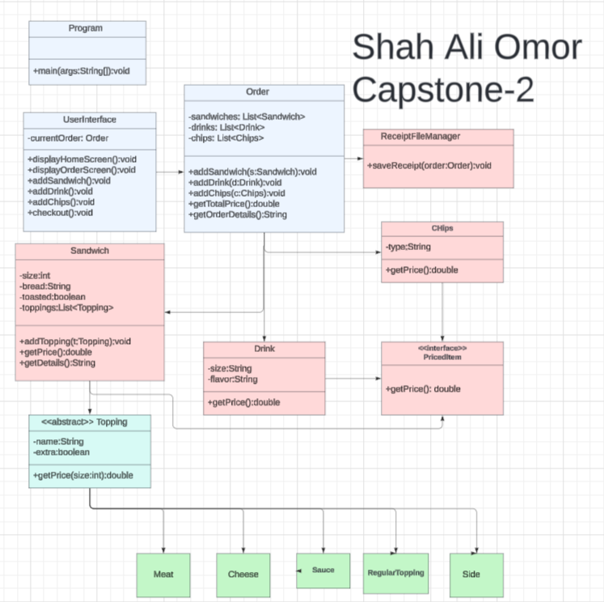
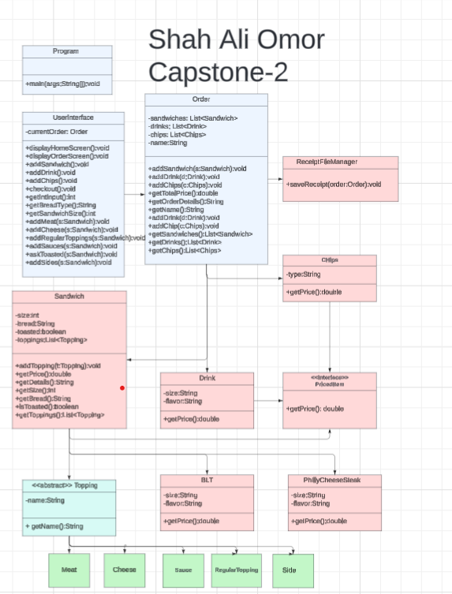
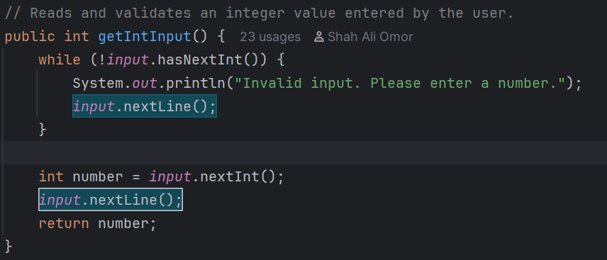
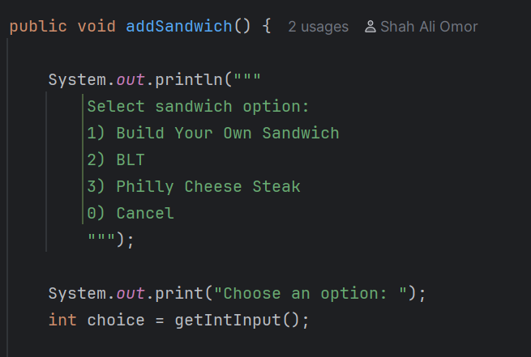
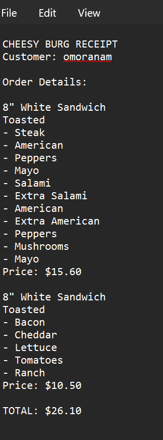

# 🍔 CHEESY BURG

## Description
CHEESY BURG is a Java command-line (CLI) application designed to simulate a custom sandwich shop ordering system. Customers can build their own sandwiches, select toppings, add drinks and chips, choose signature sandwiches, and generate receipts during checkout.

This project demonstrates core Java concepts including file handling, collections, inheritance, interfaces, conditional logic, input validation, and object-oriented programming (OOP).

---

## Running the Code
The easiest way to run the application is:

1. Open the project in IntelliJ IDEA
2. Navigate to:
   `Main.java`
3. Click the Run ▶️ button or press **Shift + F10**

---

## 🌟 Signature Sandwiches

This application includes two signature sandwiches:

- 🥓 BLT
- 🥩 Philly Cheese Steak

---
## Features

- 🍞 Build Your Own Sandwich
- 📏 Multiple Sandwich Sizes (4", 8", 12")
- 🥩 Premium Meat Selection
- 🧀 Premium Cheese Selection
- ➕ Extra Meat and Extra Cheese Options
- 🥬 Regular Toppings
- 🥫 Multiple Sauce Choices
- 🔥 Toasted Sandwich Option
- 🥤 Add Drinks
- 🥔 Add Chips
- ⭐ Signature Sandwiches (BLT & Philly Cheese Steak)
- 🧾 Receipt Generation
- 💵 Automatic Price Calculation
- 📂 Receipt File Storage
- ✅ Input Validation to Prevent Crashes

---

## UML Diagram

# Before Development

This UML diagram represents the original design and planning of the application before development began.

## After Development

This UML diagram represents the final implementation after features, classes, and relationships were refined throughout the development process.
!

---

## Code I'm Most Proud Of

I am proud of my getIntInput() method because it is one of my defensive programming solutions. Instead of assuming users will always enter valid numbers, I added validation to handle incorrect input gracefully. The method prevents the application from crashing, displays a helpful error message, and continues prompting until a valid integer is entered. This improved the reliability and user experience of my application.

I'm most proud of the `addSandwich()` feature because it is the core functionality of the application. This method allows customers to choose between building their own sandwich or selecting one of the signature sandwiches, such as the BLT or Philly Cheese Steak.

Developing this feature required me to combine multiple classes and methods together, including sandwich customization, toppings, pricing, and inheritance. It helped me better understand how object-oriented programming concepts work together to create a real-world application.
---

## My Personal Challenges

One of the biggest challenges I faced was implementing the receipt generation feature. I had to make sure all order items, including sandwiches, drinks, chips, toppings, and prices, were displayed correctly and saved to a text file.

Another challenge was calculating the total price accurately while keeping the code organized and avoiding duplicate calculations. Debugging file paths, formatting the receipt output, and ensuring receipts were saved successfully required careful testing and troubleshooting.

Overall, these challenges helped me improve my understanding of file handling, object-oriented programming, and debugging in Java.

## What I'd Do If I Had More Time

If I had more time, I would allow customers to choose drink flavors and chip brands to provide more customization options.

I would also add additional signature sandwiches and improve the receipt formatting.

Additionally, I would explore creating a graphical user interface (GUI) version of the application to improve usability and provide a more modern experience.

---

## Next Time...

Next time, I would spend more time planning the application's architecture before writing code. Better planning would help reduce refactoring and make development more efficient.

I would also create more diagrams and test each feature more thoroughly during development rather than waiting until larger sections were completed.

Overall, I would focus on stronger planning, testing, and documentation to improve both efficiency and code quality.

---

## Author

**Shah Ali Omor**

Capstone 2 